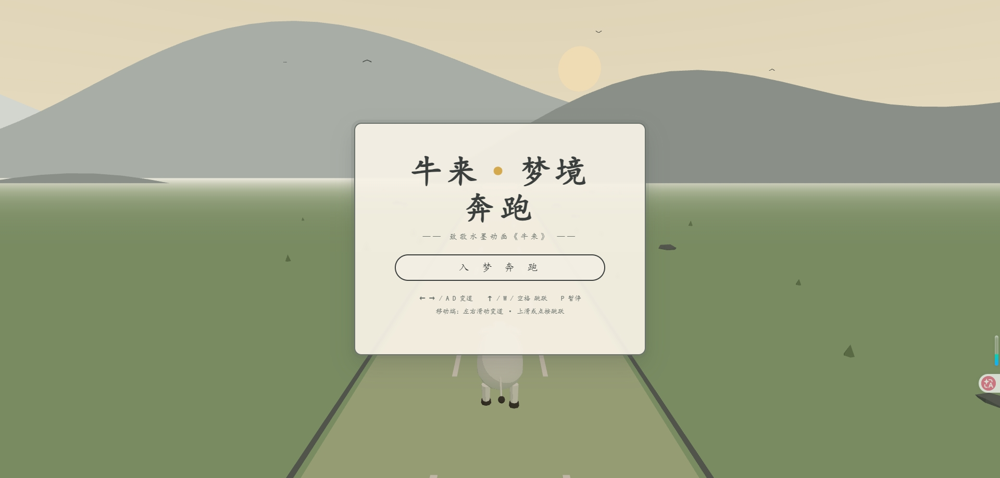

# 牛来·梦境奔跑（Niulai: Dream Runner）

> 致敬 2026 年国产水墨动画电影《牛来》的 3D 网页跑酷冒险游戏

**在线试玩：** https://subtle-cuchufli-7ac6d0.netlify.app/



初生牛犊"牛来"入梦奔跑——在宣纸色天空与淡彩草原之间，跳跃越过墨岩、枯木与草蛇，
变道躲开迎面而来的墨狼，拾起云雀的金色羽毛。奔跑越远，梦境越深。

## 玩法说明

| 操作 | 键盘 | 触摸（移动端） |
|------|------|----------------|
| 变道 | ← → 或 A D | 左右滑动 |
| 跳跃 | ↑ / W / 空格 | 上滑或轻点屏幕 |
| 暂停 | P 或 Esc | 点击"暂停"按钮 |
| 开始 / 重开 | 空格（菜单或结算界面） | 点击按钮 |

- **得分** = 奔跑距离 × 1 + 金羽 × 10，最高分自动保存（localStorage）
- **难度**：速度从 10 起步，每 10 秒 +0.5，封顶 22
- **入梦渐变**：随奔跑距离推进，雾气渐浓、色调渐入青墨——呼应电影的梦境叙事

## 电影意象对照

| 游戏元素 | 《牛来》出处 |
|----------|--------------|
| 牛来（乳白小牛犊） | 主角：草原初生的孱弱牛犊 |
| 金色羽毛 | 云雀：从荒漠飞来的梦境见证者 |
| 墨狼（高大，须变道） | 袭击牛群、牛妈妈为护子牺牲的狼群 |
| 草蛇（地面障碍） | 牛来童年被草蛇咬伤的阴影 |
| 墨岩 / 枯木 / 草原 / 远山云雾 | 草原场景与官方水墨写意美术 |

## 快速开始

环境要求：Node.js ≥ 18，包管理器 pnpm（或 npm）。

```bash
# 安装依赖
pnpm install

# 启动开发服务器（默认 http://localhost:5173）
pnpm dev

# 生产构建（输出到 dist/）
pnpm build

# 本地预览构建产物
pnpm preview
```

> 注：若 `pnpm dev` 因构建脚本审批报错（ERR_PNPM_IGNORED_BUILDS），
> 项目已通过 `pnpm-workspace.yaml` 声明 esbuild 构建许可；如仍遇到，
> 可执行 `pnpm rebuild esbuild` 后直接运行 `node_modules/.bin/vite`。

## 技术栈

- **Three.js**（WebGL 渲染，MeshToonMaterial 水墨平涂 + Shader 渐变天空穹顶）
- **Vite**（开发 / 构建）
- **原生 JavaScript**（ES Modules，自研轻量物理：车道插值 / 跳跃抛物线 / AABB 碰撞）
- **HTML + CSS** 水墨风 UI overlay（楷体、宣纸质感、径向墨晕转场）

## 项目结构

```
├── index.html                  # 入口：画布容器 + UI 覆盖层
├── src/
│   ├── main.js                 # 程序入口
│   ├── config.js               # 全局配置（色彩/车道/速度/跳跃，一站式调参）
│   ├── core/
│   │   ├── game.js             # 状态机 + 主循环（menu/playing/paused/gameover）
│   │   ├── scene-manager.js    # 渲染器/相机/灯光/雾/天空
│   │   └── input.js            # 键盘 + 触摸手势统一输入
│   ├── player/cow.js           # 牛来：几何体建模 + 程序化动画 + 物理
│   ├── world/
│   │   ├── track.js            # 三车道无限滚动赛道
│   │   ├── obstacles.js        # 障碍对象池（墨岩/枯木/草蛇/墨狼）+ 碰撞
│   │   ├── feathers.js         # 云雀金羽收集品
│   │   └── environment.js      # 水墨远山/飞鸟/太阳 + 入梦渐变
│   ├── effects/materials.js    # 水墨材质工厂（toon/flat 双分支 + 缓存池）
│   └── ui/hud.js               # 菜单/HUD/暂停/结算界面管理
└── docs/
    ├── visual-design-reference.md   # 视觉设计参考（电影调研结论）
    └── development-guide.md         # 开发说明（架构与扩展指南）
```

## 性能

- 桌面 Chrome 实测 **60 FPS 满帧**（1920×1080 / pixelRatio ≤ 2）
- 障碍、羽毛、地砖全部**对象池复用**；几何体与材质全局共享
- 无阴影贴图、无后处理链，移动端友好

## 相关文档

- [视觉设计参考文档](docs/visual-design-reference.md) —— 电影调研结论与色彩体系
- [开发说明](docs/development-guide.md) —— 架构、数据流与扩展指南

---

*本作为致敬性质的非商业同人作品。《牛来》由信雨萌执导、孙丽芳编剧，2026 年 8 月 5 日上映。*
